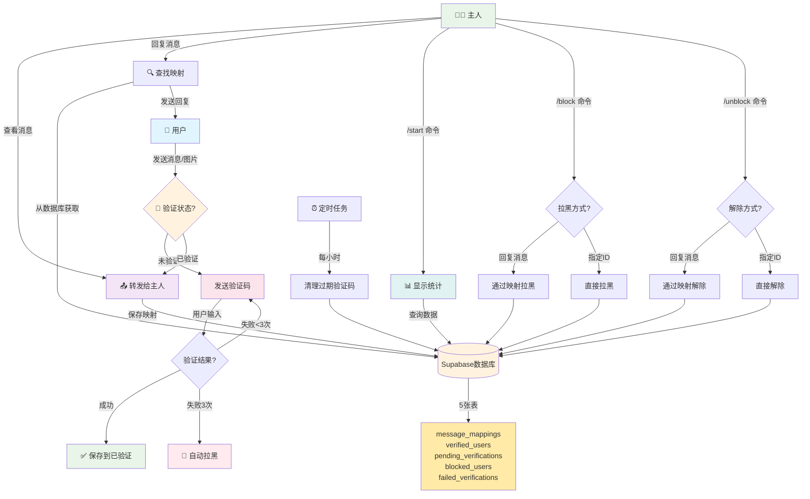

<div align="center">


</div>

# Telegram 消息转发机器人

具有图片验证码和用户管理功能的 Telegram 消息转发机器人。

## ✨ 特性

- 🔐 图片验证码防垃圾消息
- 💬 主人回复功能（直接回复转发消息）
- 🚫 用户拉黑/解除拉黑（`/block` 和 `/unblock` 命令）
- ☁️ Supabase 云数据库（数据永不丢失）
- 🐳 Docker 支持

## 🔄 完整功能流程



## 🚀 快速开始
先配置数据库
### 配置 Supabase 数据库

在 [Supabase](https://supabase.com) 创建项目，然后在 SQL Editor 中执行：

```sql
-- 消息映射表
CREATE TABLE message_mappings (
  id BIGSERIAL PRIMARY KEY,
  forwarded_message_id BIGINT UNIQUE NOT NULL,
  user_id BIGINT NOT NULL,
  username TEXT,
  created_at TIMESTAMPTZ DEFAULT NOW()
);

-- 已验证用户表
CREATE TABLE verified_users (
  id BIGSERIAL PRIMARY KEY,
  user_id BIGINT UNIQUE NOT NULL,
  username TEXT,
  verified_at TIMESTAMPTZ DEFAULT NOW()
);

-- 待验证用户表
CREATE TABLE pending_verifications (
  id BIGSERIAL PRIMARY KEY,
  user_id BIGINT UNIQUE NOT NULL,
  code TEXT NOT NULL,
  attempts INTEGER DEFAULT 0,
  expires_at TIMESTAMPTZ NOT NULL,
  created_at TIMESTAMPTZ DEFAULT NOW()
);

-- 拉黑用户表
CREATE TABLE blocked_users (
  id BIGSERIAL PRIMARY KEY,
  user_id BIGINT UNIQUE NOT NULL,
  blocked_at TIMESTAMPTZ DEFAULT NOW()
);

-- 创建索引
CREATE INDEX idx_message_mappings_forwarded_id ON message_mappings(forwarded_message_id);
CREATE INDEX idx_verified_users_user_id ON verified_users(user_id);
CREATE INDEX idx_pending_verifications_user_id ON pending_verifications(user_id);
CREATE INDEX idx_blocked_users_user_id ON blocked_users(user_id);
```

### 🐳 Docker 部署

### 方法一：直接运行

```bash
docker run -d \
  --name telegram-bot \
  --restart unless-stopped \
  -e BOT_TOKEN="你的Bot_Token" \
  -e OWNER_ID="你的用户ID" \
  -e SUPABASE_URL="你的Supabase_URL" \
  -e SUPABASE_KEY="你的Supabase_Key" \
  -v $(pwd)/logs:/app/logs \
  ghcr.io/ham0mer/tgbot:latest
```

### 方法二：使用 docker-compose

修改 `docker-compose.yml`：

```yaml
services:
  telegram-bot:
    image: ghcr.io/ham0mer/tgbot:latest
    container_name: telegram-bot
    restart: unless-stopped
    environment:
      - BOT_TOKEN=${BOT_TOKEN}
      - OWNER_ID=${OWNER_ID}
      - SUPABASE_URL=${SUPABASE_URL}
      - SUPABASE_KEY=${SUPABASE_KEY}
      - LOG_LEVEL=info
    volumes:
      - ./logs:/app/logs
    logging:
      driver: "json-file"
      options:
        max-size: "10m"
        max-file: "3"
```

然后启动：

```bash
docker compose up -d
```

### 启动并查看日志

```bash
docker compose up -d && docker compose logs -f
```

## 🔄 更新镜像

### 更新到最新版本

```bash
docker compose pull && docker compose down && docker compose up -d && docker compose logs -f
docker image prune
```


##  使用说明

### 用户使用
1. 发送 `/start` 获取验证码
2. 回复验证码完成验证
3. 验证后可正常发送消息

### 主人功能
- **回复用户**：直接回复转发的消息
- **拉黑用户**：回复用户消息并发送 `/block`
- **解除拉黑**：回复用户消息并发送 `/unblock`

##  项目结构

```
TGbot/
 src/
    bot.js                    # Bot 核心
    handlers/messageHandler.js # 消息处理
    filters/adFilter.js       # 验证码系统
    utils/
        supabaseClient.js     # Supabase 客户端
        supabaseDatabase.js   # 数据库管理
 database/supabase_schema.sql  # 数据库表结构
 .env                          # 环境变量
 docker-compose.yml            # Docker 配置
```

## License

MIT
